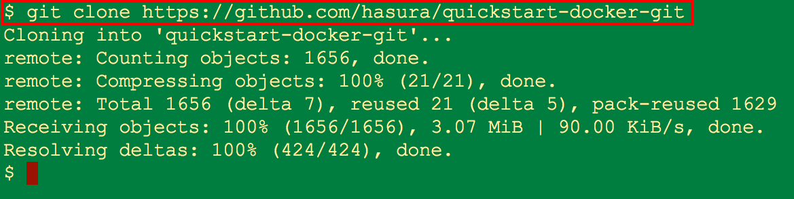
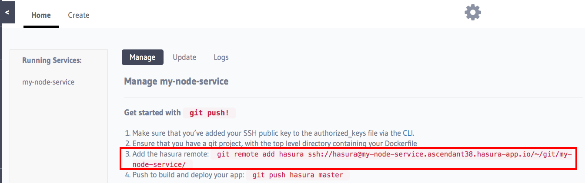
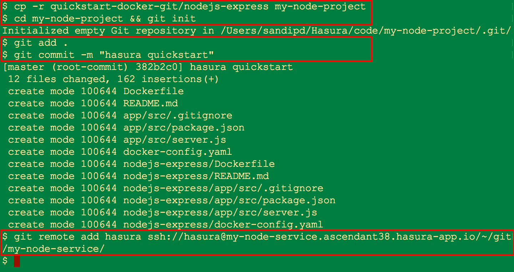
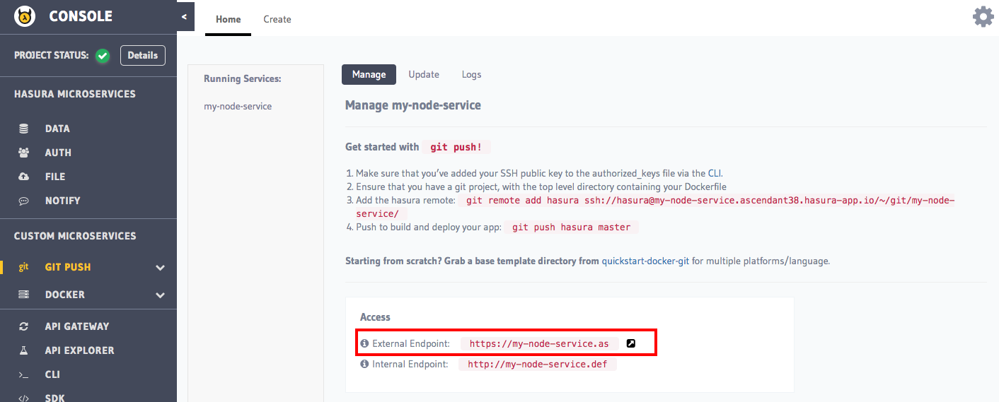
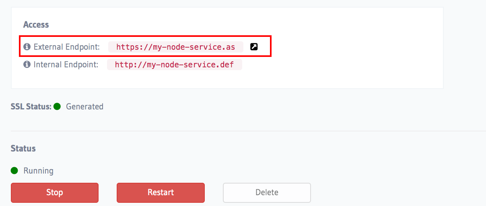

# quickstart-docker-git

[Hasura](https://hasura.io) is a platform for building and deploying application backends. The platform is a [Kubernetes](https://kubernetes.io) based PaaS (*Platform-as-a-Service to deploy backends*) and a PostgreSQL based BaaS (*Backend-as-a-Service to rapidly build backends*).

To help you quickly bootstrap your app backend in your favourite language/framework or with a product of your choice in a Hasura project, this repository maintains a collection of starter kits for popular options.

Some examples:
- Hello-world for [python-flask](https://github.com/hasura/quickstart-docker-git/tree/master/python-flask), [java-spring boot](https://github.com/hasura/quickstart-docker-git/tree/master/java-spring-boot), [nodejs-express](https://github.com/hasura/quickstart-docker-git/tree/master/nodejs-express) [php-apache](https://github.com/hasura/quickstart-docker-git/tree/master/php-apache), [.Net](https://github.com/hasura/quickstart-docker-git/tree/master/csharp-aspnet), etc.
- Static file service based on [nginx](https://github.com/hasura/quickstart-docker-git/tree/master/nginx)
- Web service in Swift ([Vapor](https://github.com/hasura/quickstart-docker-git/tree/master/swift-vapor), [Perfect](https://github.com/hasura/quickstart-docker-git/tree/master/swift-perfect))
- Deploying a [MySQL](https://github.com/hasura/quickstart-docker-git/tree/master/mysql) service
- [Wordpress](https://github.com/hasura/quickstart-docker-git/tree/master/wordpress)

**What is not included**: This is just a collection of starter kits. The idea is to modify the kits as you need to get to a basic setup that works. Hence, this doesn't include things like setting up docker-compose files or more advanced framework specific configurations yet.

# Getting Started in 5 easy steps

To use any of the starter kits, follow these instructions:

1. Create a project: activate your free-trial project here: [https://dashboard.hasura.io](https://dashboard.hasura.io) (*requires sign up or log in*).

2. Add your SSH key to the project console: [instructions on creating and adding your SSH key](https://docs.hasura.io/0.14/ref/cli/adding-SSH-keys-to-a-project.html).

3. Create a custom ``git push`` microservice: see [reference documentation](https://docs.hasura.io/0.14/ref/custom-microservices/creating-git-push-microservices.html#adding-a-git-push-enabled-service).

4. Clone and prep this repo to use your favourite language/framework:
     
   - Clone this repo:
     
     ``git clone https://github.com/hasura/quickstart-docker-git``



   - Copy the relevant starter kit: e.g. to use the nodejs + express starter kit,
  
     ``cp -r quickstart-docker-git/nodejs-express my-node-project``

   - Initialize a git repo inside this folder:
     
     ``cd my-node-project && git init``

5. git push the starter kit to deploy:

   - stage the files in the starter kit and commit them.
     
     ``git add . ``
     
     ``git commit -m "hasura quickstart" ``

   - copy the git remote location from the console (*the service's manage page*)
     

     
   - Add the service's git remote

     ``git remote add hasura ssh://hasura@<service-name>.<project-name>.hasura-app.io/~/git/<service-name>/``
     
     **Note: replace *\<service-name>*, *\<project-name>* with the name/sub-domain of the service created in step-3 and name of the project created in step-1 respectively. Check the image below for reference**



   - push your changes to the remote

     **``git push hasura master``**
     
That's it! Your starter kit in now live :balloon: :tada: :beers: :balloon:! Check it out at the service's external endpoint (*from step-3*).



# Next Steps

Yay! If you followed the 5 steps in the previous section, you would have deployed a web application to the cloud from scratch without breaking a sweat. To understand the Hasura platform in more detail, we highly recommend doing at least one of the following:

- Check out the mini-interactive tutorials built right into the project console.



- Check out our [documentation](https://docs.hasura.io)

- Just talk to us - drop us an email at support@hasura.io or ping us using the chat window [here](https://hasura.io)

# Additional Information

- **BaaS Samples**: Sample code is being added to each starter kit for demonstrating Hasura BaaS features like [Data](https://docs.hasura.io/0.14/ref/hasura-microservices/data/index.html), [Auth](https://docs.hasura.io/0.14/ref/hasura-microservices/auth/index.html), [Notify](https://docs.hasura.io/0.14/ref/hasura-microservices/notify/index.html), and [File](https://docs.hasura.io/0.14/ref/hasura-microservices/filestore/index.html) services. Meanwhile, feel free to get in touch with us if you need any help.

- **Docker**: You can use ``docker build`` and ``docker run`` to build your own image and get a running container. Basic configuration options are specified in ``docker-config.yaml``. [Custom or 3rd party Docker images can be deployed on Hasura](https://docs.hasura.io/0.14/ref/custom-microservices/creating-docker-microservices.html) with the same ease.

- **Repo structure**: Every starter kit has the following structure:
  ```
  /
  --Dockerfile
  --docker-config.yaml
  --README.md
  --app/
  ```

  The README inside each starter kit contains further instructions.
  
- **Automated Docker hub builds**: All starter kits in this collection can readily be integrated to setup an automated docker image build system.
  
  Read here for more details:
  [https://docs.docker.com/docker-hub/github/](https://docs.docker.com/docker-hub/github/)


# Contribution Needed!

Please fork, file comments/bugs and submit your PRs!  We've created a list of
issues where active help is required:
[help-wanted](https://github.com/hasura/quickstart-docker-git/issues?q=is%3Aissue+is%3Aopen+label%3Ahelp-wanted).

Specifically,

1. Add support for more frameworks
2. Optimise ``Dockerfile``s for faster builds, or for production (esp. for compiled languages)

Some important things to keep in mind when contributing:

1. Expose only one port, and one data volume to help keep things simple
2. Annotate the ``Dockerfile`` with comments where you expect users to modify
3. Try to document the following major use cases when writing your README: ``docker build``, ``git push`` based automated docker build, ``docker run``